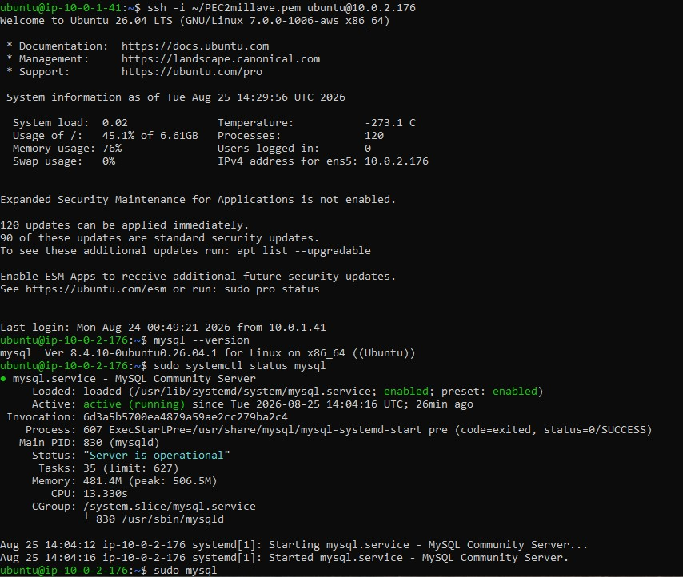
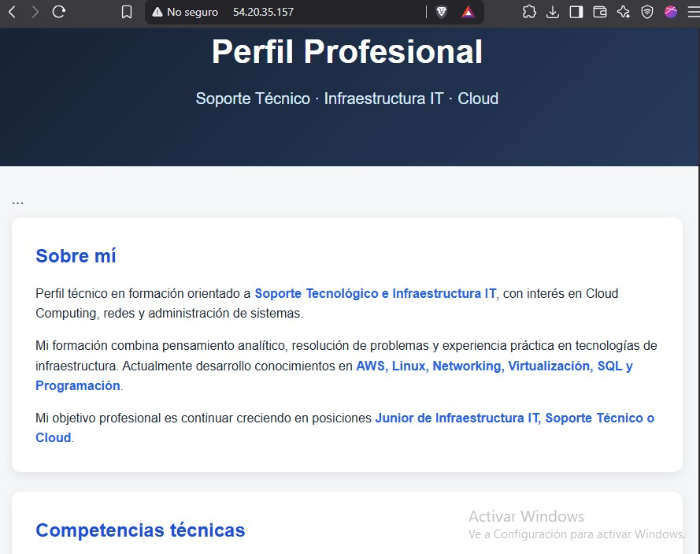
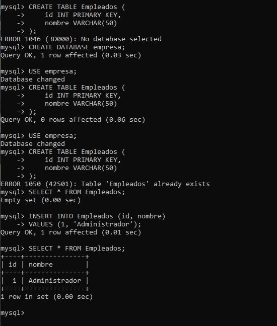

# Cloud-Ready Ops — AWS Infrastructure Lab

Proyecto práctico de infraestructura y operaciones cloud implementado en AWS.
## 📑 Índice

- [Objetivo](#Objetivo)
- [Arquitectura](#Arquitectura)
- [Infraestructura](#Infraestructura)
- [Seguridad](#Seguridad)
- [Servidor Web](#Servidor-web)
- [Base de Datos](#Base-de-datos)
- [Pruebas](#Pruebas)
- [Tecnologías](#Tecnologías)
- [Aprendizajes](#Aprendizajes)

##Objetivo

Diseñar e implementar una infraestructura básica en AWS aplicando conceptos de redes, seguridad, servidores y bases de datos.

El proyecto implementa una arquitectura segmentada mediante una VPC con una subred pública para el servidor web y una subred privada para la base de datos.

##Arquitectura

La infraestructura está compuesta por:

- VPC `10.0.0.0/16`
- Subred pública `10.0.1.0/24`
- Subred privada `10.0.2.0/24`
- Internet Gateway
- Dos instancias EC2
- Security Groups
- Nginx
- MySQL

### Diagrama


##Infraestructura

### Subred pública

La instancia Web se encuentra en la subred pública y posee una IP pública para recibir tráfico HTTP.

### Subred privada

La instancia de Base de Datos se encuentra en la subred privada y no posee IP pública.

La comunicación entre ambas instancias se realiza mediante la red privada de la VPC.

##Seguridad

Se utilizaron Security Groups como firewall virtual.

| Servicio | Puerto | Origen |
|---|---:|---|
| SSH | 22 | IP autorizada |
| HTTP | 80 | Internet |
| MySQL | 3306 | Security Group Web |

La base de datos no se expone directamente a Internet. El acceso al puerto 3306 está restringido al Security Group del servidor Web.

##Servidor Web

Se implementó un servidor Web mediante **Nginx** sobre Ubuntu Server.

Se realizaron pruebas mediante:

```bash
sudo systemctl status nginx
curl http://localhost
```

También se verificó el acceso externo mediante HTTP utilizando la IP pública de la instancia.


##Base de Datos

Se implementó **MySQL** en una instancia EC2 ubicada en la subred privada.

Se creó la base de datos `empresa` y una tabla `Empleados` para validar la conectividad y funcionamiento del servicio.

```sql
CREATE DATABASE empresa;

CREATE TABLE Empleados (
    id INT PRIMARY KEY,
    nombre VARCHAR(50)
);
```
Se verificó la información mediante:
```
SELECT * FROM Empleados;
```


##Pruebas

Se realizaron pruebas de:

- Conectividad SSH.
- Estado del servicio Nginx.
- Respuesta HTTP.
- Conectividad local mediante `curl`.
- Revisión de logs.
- Comunicación Web → Base de Datos.
- Acceso restringido mediante Security Groups.

##Tecnologías

- AWS
- Amazon VPC
- Amazon EC2
- Security Groups
- Ubuntu Server
- Nginx
- MySQL
- SSH
- GitHub
- Linux

##Aprendizajes

Durante el laboratorio se trabajó sobre conceptos fundamentales de infraestructura Cloud:

- Diseño y segmentación de redes.
- Subredes públicas y privadas.
- Control de acceso mediante Security Groups.
- Administración de servidores Linux.
- Implementación de servicios Web.
- Implementación de bases de datos.
- Comunicación segura entre servidores mediante reglas de red.
- Troubleshooting mediante comandos y logs.
- Documentación y versionado mediante GitHub.
